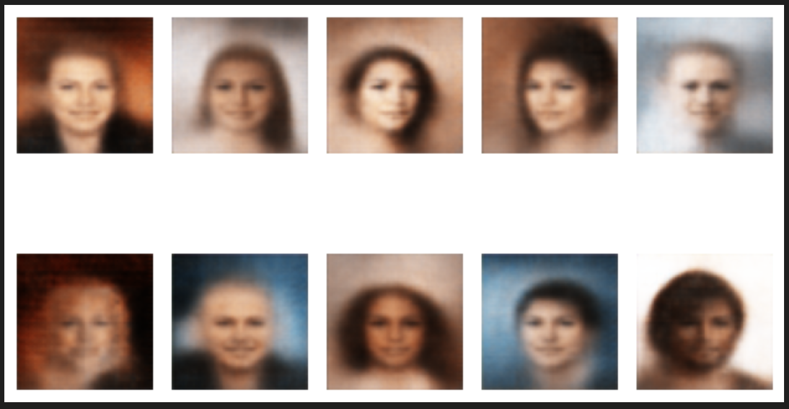

# vae-lab

Experiments with simple Variational-Autoencoder (VAE) in PyTorch

1. create a Python venv
2. install PyTorch
3. explore scripts & notebook

```python
# Explore the latent space

with torch.no_grad():
    dd = d[2] # desired direction

    iter = torch.arange(10, device=device)
    x = t + 50*iter[:, None]*dd[None, :]

    path = vae.decode(x)
    util.plot_image_grid(1, 10, path.cpu())
```


```python
# Decode random latent vectors

with torch.no_grad():
    z = torch.randn(10, LATENT_SIZE).to(device)
    recon = vae.decode(z*3)
    util.plot_image_grid(2, 5, recon.cpu())
```



#### ideas

- try a round gaussian mask for original and reconstruction to give the center
  of the image, the face, most weight for mse loss (fade into black, transparency?)